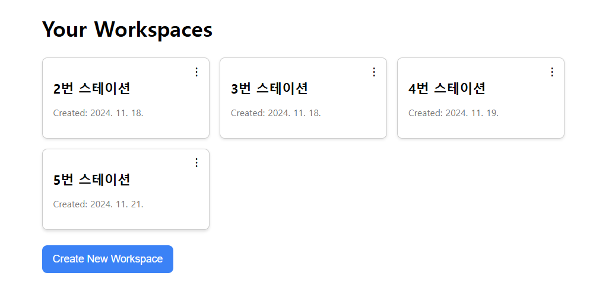
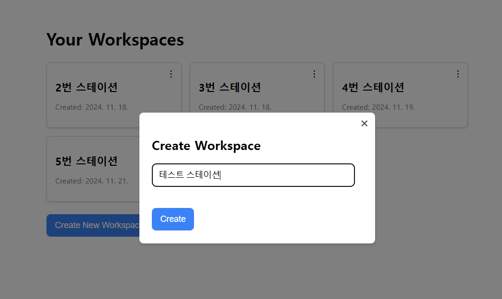
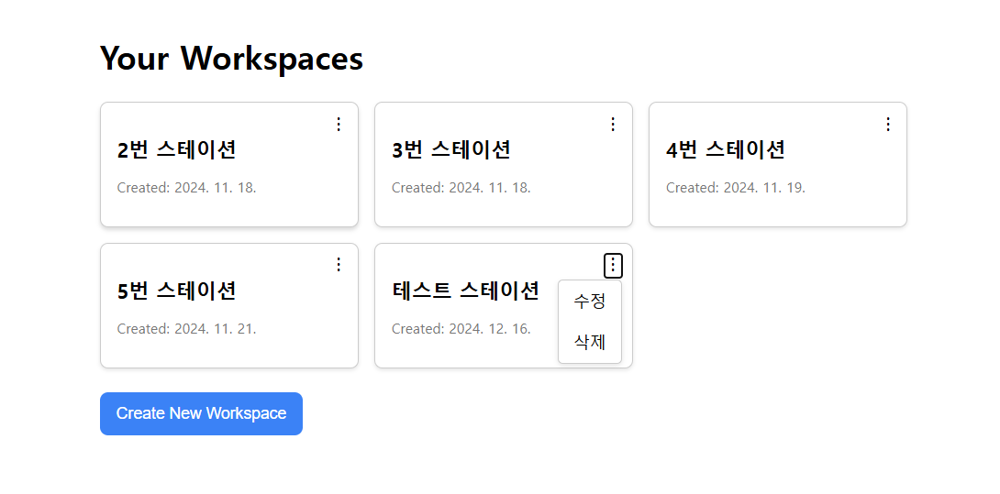
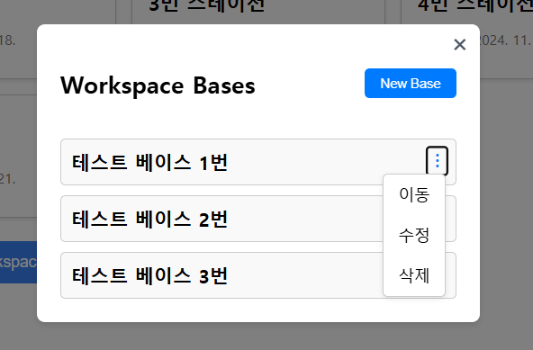
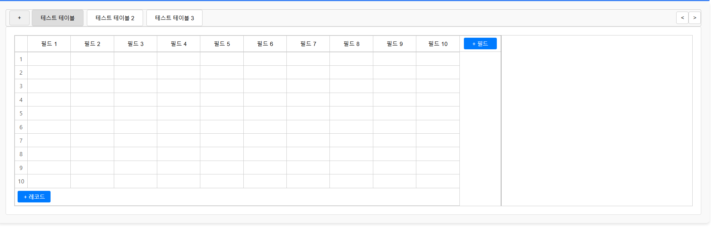
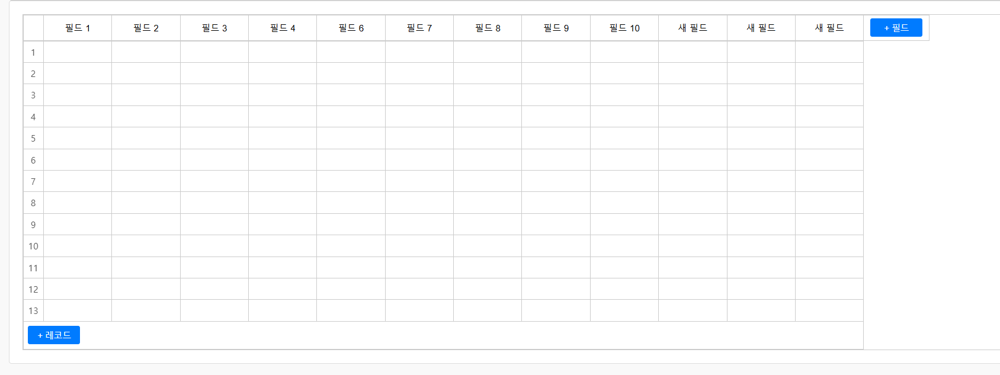
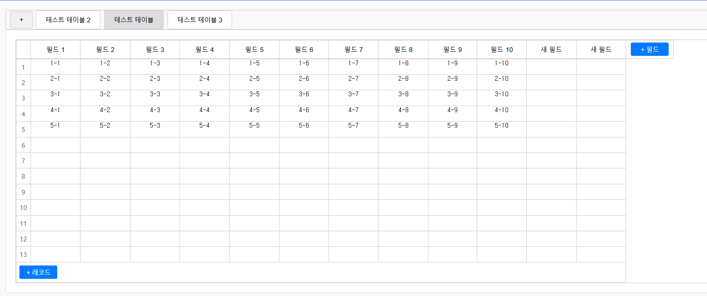

# 개요

* 프로젝트 이름 : MyAirTable
* 프로젝트 기간 : 2024.11 ~ 2024.12
* 개발언어 : 백엔드 - spring, 프론트 - react

# 기술 Stack

# 사용 예시

워크스페이스로 크게 나눔 

워크스페이스 내부의 베이스는 다른 워크스페이스로 이동이 가능함

\+ 버튼으로 레코드와 필드 (행,열)을 추가할 수 있으며, 각각의 레코드와 필드를 우클릭해서 삭제도 가능함

필드명, 각각의 칸에는 원하는 값을 입력할 수 있음

각각의 테이블, 필드, 레코드는 드래그&드롭으로 위치를 이동시킬 수 있음

레코드와 필드 사이를 드래그&드롭으로 크기를 조절할 수 있음